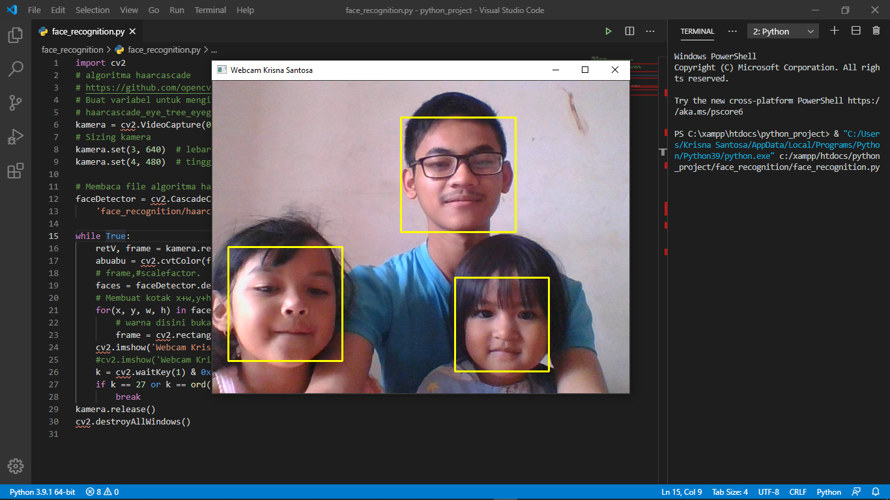

# Face Detector / Pendeteksi Wajah

## Library

- [OpenCV](https://opencv.org/)
- [Haarcascade Algorithm](https://github.com/opencv/opencv/tree/master/data/haarcascades)

## How to use

- Clone this repository
- Install OpenCV
- Run `python face_detector.py`

## Result

